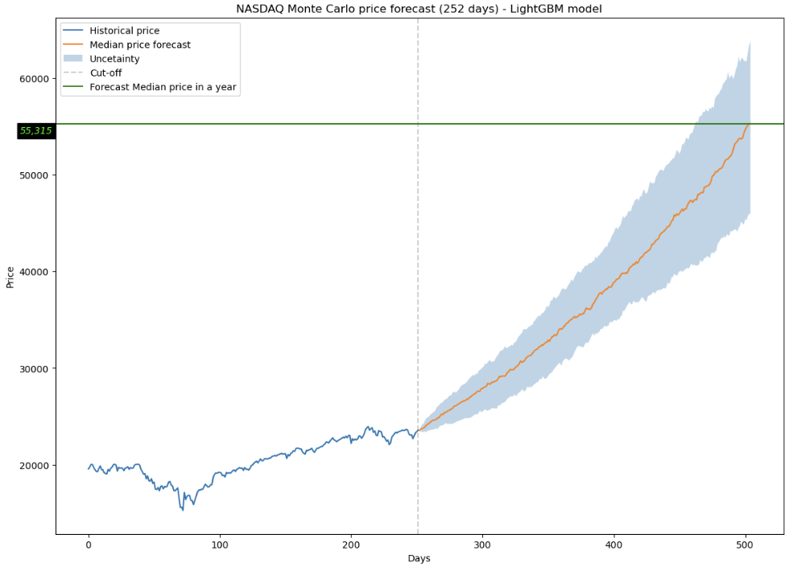

# NASDAQ Price Forecast Using Machine Learning and Monte Carlo Simulation
An educational project combining machine learning and Monte Carlo simulation to explore possible future NASDAQ price paths.

The goal of the project was to model uncertainty and visualize a range of possible outcomes.

## Final result
This model estimates a constant expected return over the course of the simulation. Since the features are kept fixed, the same average return is predicted on each step. Random noise is added to create uncertainty, but when the median is taken across multiple simulations, short-term fluctuations are cancelled out, resulting in a smooth forecast. The model's median forecast estimates NASDAQ at 53165$ by the end of 2026.

## Libraries used:
- numpy
- pandas
- matplotlib
- yfinance
- lightgbm
- Scikit-learn
